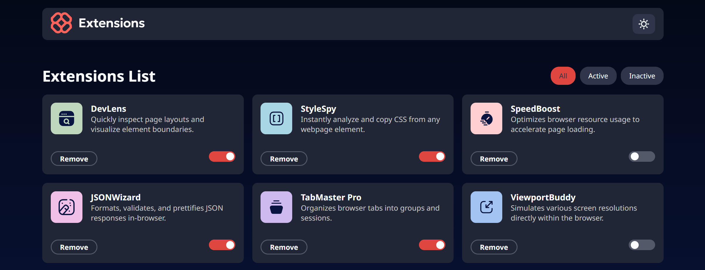

# Frontend Mentor - Browser extensions manager UI solution

This is a solution to the [Browser extensions manager UI challenge on Frontend Mentor](https://www.frontendmentor.io/challenges/browser-extension-manager-ui-yNZnOfsMAp). Frontend Mentor challenges help you improve your coding skills by building realistic projects. 

## Table of contents

- [Overview](#overview)
  - [The challenge](#the-challenge)
  - [Screenshot](#screenshot)
  - [Links](#links)
- [My process](#my-process)
  - [Built with](#built-with)
  - [What I learned](#what-i-learned)
  - [Continued development](#continued-development)
  - [Useful resources](#useful-resources)
- [Author](#author)
- [Acknowledgments](#acknowledgments)


## Overview
The Browser extensions manager UI was built with Reactjs(vite) and pure CSS.

It handle state method for all, active and inActive functionality, it also removes list from the array and toggle the active state of the array
### The challenge

Users is able to:

- Toggle extensions between active and inactive states
- Filter active and inactive extensions
- Remove extensions from the list
- Select their color theme
- View the optimal layout for the interface depending on their device's screen size
- See hover and focus states for all interactive elements on the page

### Screenshot

DarkMode

LightMode


### Links

- Solution URL: [Add solution URL here](https://your-solution-url.com)
- Live Site URL: [Add live site URL here](https://your-live-site-url.com)

## My process

### Built with

- React
- CSS custom properties
- [Flexbox](https://www.w3schools.com/css/css3_flexbox.asp)
- [CSS Grid](https://www.w3schools.com/css/css_grid.asp)
- [media queries](https://www.w3schools.com/css/css3_mediaqueries.asp) - screen viewport
- [React](https://reactjs.org/) - JS library
- [Styled Components](https://styled-components.com/) - For styles


### What I learned

***"Sometime it not just knowing the syntax but when and where to implement it"***, Got lost when trying to add the filter method of **active and inActive** the you add the **toggle and remove list** using it existing state/list but that was rough because I didn't realise that the updated state/list of the existing/list won't be available cause the state is still holding on the updated one
i.e when you click active it get the active list but when you click all instead of show both active and inActive it just show active same with the inActive.

To see how you can add code snippets, see below:

```js
  const [extensionListItem, setExtensionListItem] = useState(extensionLists);
  const [masterList, setMasterList] = useState(extensionLists);
  const [filterMode, setFilterMode] = useState("all");
```
```js
function allList() {
    setExtensionListItem(masterList); // get all list from masterList
    setFilterMode("all")
  }
  function activeList() {
    setExtensionListItem(masterList.filter((list) => list.isActive)); // get active list from masterList
    setFilterMode("active")
  }

  function inActiveList() {
    setExtensionListItem(masterList.filter((list) => !list.isActive)); // get inActive list from masterList
    setFilterMode("inActive")
  }
```
```js
// toggle active/inActive
  function handleToggle(id) {
    setMasterList((prevList) => {
      let updatedList = prevList.map((list) => {
        return list.id === id ? { ...list, isActive: !list.isActive } : list;
      });

      // Preserve current filter view
      if (filterMode === "active") {
        setExtensionListItem(updatedList.filter((list) => list.isActive))
      } else if (filterMode === "inActive") {
        setExtensionListItem(updatedList.filter((list) => !list.isActive))
      } else {
        setExtensionListItem(updatedList)
      }
      return updatedList;
    });
  }

  // delete list
  function handleDelete(id) {
    setMasterList((prevList) => {
      let updatedListDeleted = prevList.filter((list) => list.id !== id);
      // Preserve current filter view
      if (filterMode === "active") {
        setExtensionListItem(updatedListDeleted.filter((list) => list.isActive))
      } else if (filterMode === "inActive") {
        setExtensionListItem(updatedListDeleted.filter((list) => !list.isActive))
      } else {
        setExtensionListItem(updatedListDeleted)
      }
      return updatedListDeleted;
    });
  }
```

If you want more help with writing markdown, we'd recommend checking out [The Markdown Guide](https://www.markdownguide.org/) to learn more.


### Continued development

One could say **critical thinking** beacause you might know the syntax and the semantic but do you know when/where it needed

### Useful resources

- [JavaScript Array filter()](https://www.w3schools.com/js/js_array_iteration.asp#mark_filter) - This helped me for filtering out list item. I really liked this pattern and will use it going forward.
- [JavaScript Array map()](https://www.w3schools.com/js/js_array_iteration.asp#mark_map) - This helped me in handling toggle for the list active property out list item. I really liked this pattern and will use it going forward.
- [ChatGPT]( https://openai.com) - I wouldn't rely on it but great in give ideas even if your solution was solved at the spot it helps you to think what it doing and you can avoid or implement a better one. I'd recommend it to anyone still learning this concept.


## Author

- Website - [maduansi](https://maduanusi.vercel.app)
- Frontend Mentor - [@therealmaduanusi](https://www.frontendmentor.io/profile/therealmaduanusi)
- Twitter - [@madu_anusi](https://www.twitter.com/madu_anusi)


## Acknowledgments

FMC for creating so challenge and me for taking it up in testing and uplifting my skills
